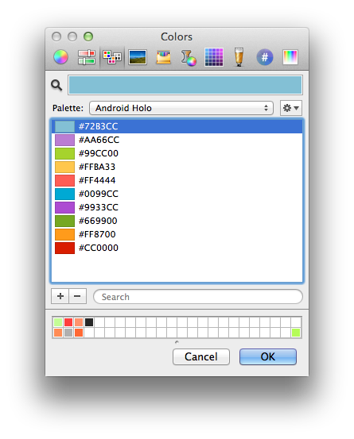

Android Holo Colors for OSX Color Picker
=======================

This is an OSX color palette of the official Android Holo Colors found in [the android design guidlines](http://developer.android.com/design/style/color.html).

To install just copy the file to `~\Library\Colors\` and you will have it available in all apps that use the system color picker. For apps that don't do that, like the Adobe Creative Suite, you can download some other formats on the [official website](https://developer.android.com/design/downloads/index.html).
